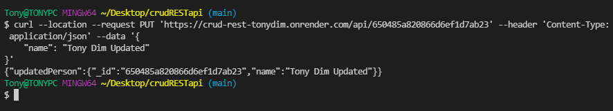

# HNGtaskTWO
Building a Simple REST API for Managing a 'person' resource with CRUD operations

## Table of Contents
- [HNGtaskTWO](#hngtasktwo)
  - [Table of Contents](#table-of-contents)
  - [5. API Usage](#5-api-usage)
    - [To CREATE A Person (POST /api)](#to-create-a-person-post-api)
    - [To READ a Single Person (GET /api/:user_id)](#to-read-a-single-person-get-apiuser_id)
    - [To UPDATE a Person's detail (PUT /api/:user_id)](#to-update-a-persons-detail-put-apiuser_id)
    - [To DELETE a Person (DELETE /api/:user_id)](#to-delete-a-person-delete-apiuser_id)
  - [6. License](#6-license)

## 5. API Usage
We can use a testing tool like Postman (or any testing tool you are familiar with) to test each CRUD operation in the API

To run tests on Postman, use the following command:

- Create a Postman account if you don't have one already, and log into Postman for the web in your browser. To use Postman in a web browser, download and run the Postman agent on your local machine to overcome cross-origin resource sharing (CORS) limitations.
- Create or open a public workspace with a unique name
- Create a new collection under your workspace

For each endpoint, the API follows the following request and response formats:

### To CREATE a Person (POST /api)

- **Standard Request Format:**
  - HTTP Method: ``` POST ```
  - Endpoint: ``` /api ```
  - Sample Url format: ``` https://crud-rest-tonydim.onrender.com/api ```
  - Request Body (JSON):
    ```
    {
      "name": "Tony Dim"
    }
    ```
- **Successful Response:**
  - HTTP Status Code: ``` 200 OK ```
  - Response Body (JSON):
    ```
  
    {
      "createdPerson": {
          "name": "Tony Dim",
          "_id": "65035bca9279fe61fdfbda31"
      }
    }
    ```
- **Failed Response:**
  - HTTP Status Code: ``` 404 Bad Request ```
  - Instance: parsing ``` { "name": "" } ``` i.e An empty request field.
  - Response Body (JSON):
    ```
    {
       "message": "name field is required"
    }
    ```

### To READ a Person's details (GET /api/:user_id)

- **Standard Request Format:**

  - HTTP Method: ``` GET ```
  - Endpoint: ``` /api/:user_id ```
  - Sample Url format: ``` https://crud-rest-tonydim.onrender.com/api/65035bca9279fe61fdfbda31 ```

- **Successful Response:**
  - HTTP Status Code: ``` 200 OK ```
  - Response Body (JSON):
    ```
    
    {
      "PersonDetails": {
          "_id": "65035bca9279fe61fdfbda31",
          "name": "obinna"
      }
    }
    ```
- **Failed Response:**
  - HTTP Status Code: ``` 404 Not Found ```
  - Instance: Parsing ``` https://crud-rest-tonydim.onrender.com/api/65038162097164357fbadf4d ``` i.e A user that does not exist in the database.
  - Response Body (JSON):
    ```
    {
       "message": "Person not found"
    }
    ```

### To UPDATE a Person's details (PUT /api/:user_id)

- **Standard Request Format:**

  - HTTP Method: ``` PUT ```
  - Endpoint: ``` /api/:user_id ```
  - Sample Url format:```  https://crud-rest-tonydim.onrender.com/api/65035bca9279fe61fdfbda31 ```
  - Request Body (JSON):
    ```
    {
      "name": "Anthony"
    }
    ```

- **Successful Response:**
  - HTTP Status Code: ``` 200 OK ```
  - Response Body (JSON):
    ```
    {
        "updatedPerson": {
            "_id": "65035bca9279fe61fdfbda31",
            "name": "Anthony"
        }
    }
    ```
- **Failed Response:**
  - HTTP Status Code: ``` 404 Not Found ```
  - Instance: Parsing ``` https://crud-rest-tonydim.onrender.com/api/65038162097164357fbadf4d ``` i.e A user that does not exist in the database.
  - Response Body (JSON):
    ```
    {
       "message": "Person not found"
    }
    ```
  ### To DELETE a Person (DELETE /api/:user_id)

- **Standard Request Format:**

  - HTTP Method: ``` DELETE ```
  - Endpoint: ``` /api/:user_id ```
  - Sample Url format: ``` https://crud-rest-tonydim.onrender.com/api/65035bca9279fe61fdfbda31 ```

- **Successful Response:**
  - HTTP Status Code: ``` 200 OK ```
  - Response Body:
  ```
    {
        "message": "Person has been deleted."
    }

  ```
- **Failed Response:**
  - HTTP Status Code: ``` 404 Not Found ```
  - Instance: Parsing ``` https://crud-rest-tonydim.onrender.com/api/65038162097164357fbadf4d ``` i.e A user that does not exist in the database or that has already been deleted.
  - Response Body:
    ```
    {
       "message": "Person not found"
    }
    ```

## Sample Usage

Here are some sample API usage scenarios:
##### *Note: make sure you have your server running*

### To CREATE a Person

   ```bash
   curl --location 'https://crud-rest-tonydim.onrender.com/api' --header 'Content-Type: application/json' --data '{
        "name": "Tony Dim"
      }'
   ```

- **Response:**

  

### To READ a Person's details

   ```bash
   curl --location 'https://crud-rest-tonydim.onrender.com/api/65048e1fcaa0559630deaafa'
   ```

- **Response:**

  

### Update a Person

   ```bash
   curl --location --request PUT 'https://crud-rest-tonydim.onrender.com/api/650485a820866d6ef1d7ab23' \
      --header 'Content-Type: application/json' \
      --data '{
          "name": "Tony Dim Updated"
      }'
   ```

- **Response:**

  

### Delete a Person

   ```bash
   curl -X DELETE http://localhost:8000/api/30/ -w "\n\n"
   ```
